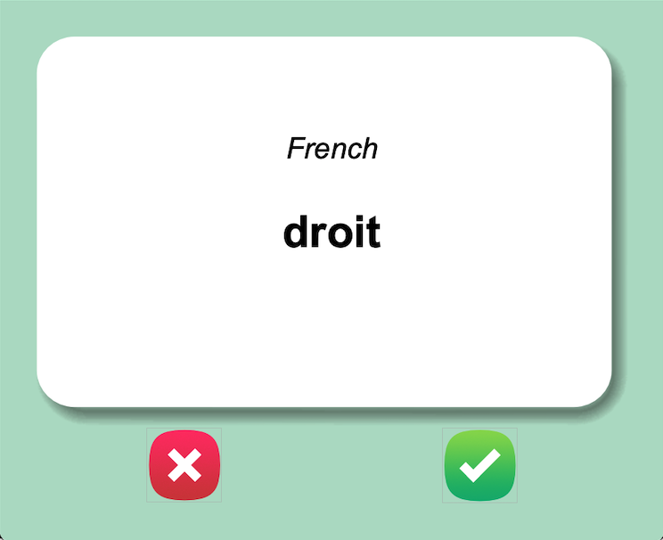
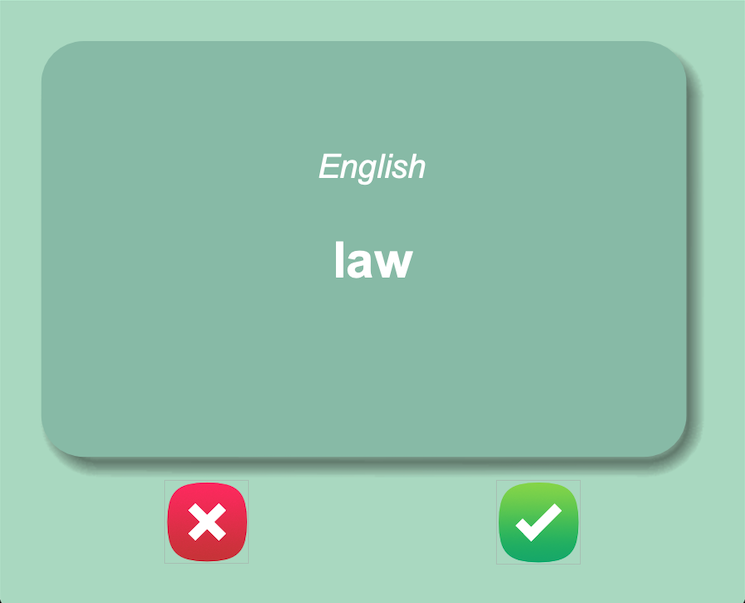

# Flash Cards App (To Learn French)
App developed with Python using Tkinter that shows French words and switch to their English translations after 3 seconds.

## Functions
- Intuitive Graphic Interface
- Shows French words and their English translation
- Keeps track of words to learn

## Technology
- Python

## Screenshots

